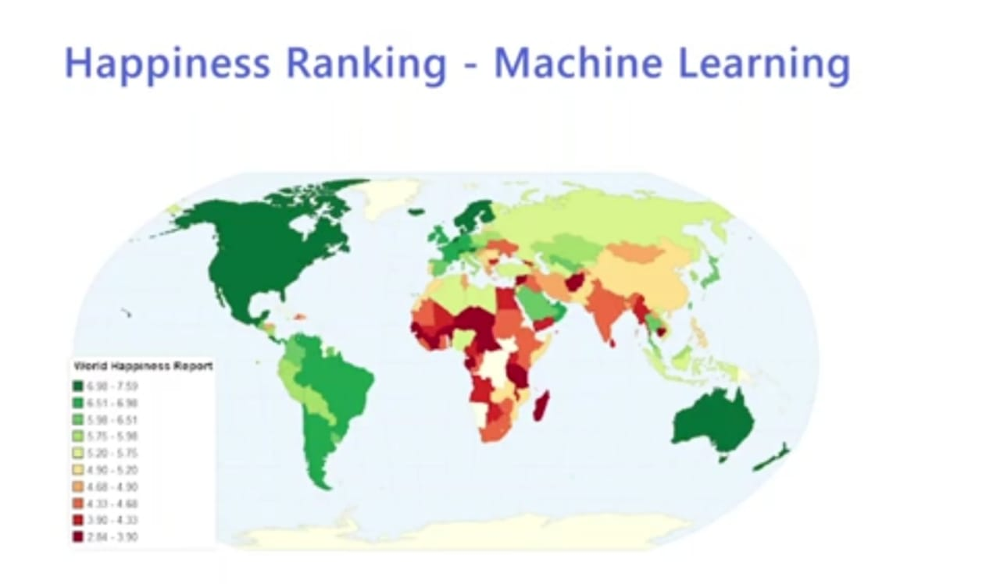

  
 

<h3> link- https://happiness-ranking-app.herokuapp.com/ </h3>

 <i> <h2>  What is Happiness Index?</h2>

<h3><i> It's an indexation of happiness based on survey results, that was first used in the 2012 World Happiness Report In the survey. the respondents were asked to rate their happiness on a scale from 0 to 10 The Happiness Index is calculated by averaging the survey results of the respondents </h2>
  
  <i> <h2> Where did it originate and why?</h2>

<h3><i>The definition of the Happiness Index originates from the Bhutanese Gross National Happiness Index In 1972, Bhutan started prioritizing happiness over other factors such as wealth, comfort and economic growth This inspired the Happiness Happiness Council to devise their own definition of the Happiness Index, which was coined in the 2012 World Happiness Report</h2>

 

<h2> Details of the Project

<h3> The Project is divided into three parts
<h3>1- Building a machine learning model to predict Happiness Rankings
<h3>2. We build a web app on Django to mount the prediction model. 
<h3>3. We deploy the Django project on Heroku through github.

     
  
 
<h2>Machine Learning Model

<h3> So we start off with building a machine learning model using simple Linear Regression model and train that model using the Happiness index dataset. For this project you will also see StandardScaler in action and why we have implemented it also </h3>
    
  
  <h2>Deploying on Heroku

<h3> This is the last part where we will deploy the Django application on Heroku using the connections to github. </h3>
    

 

     
  
  <h1> Screenshots </h1>
  <h2> Input Screen </h2>
 
 
    
  
<h2> Output Screen </h2> 

   
  
    

### Give It a Star if you liked the project 
